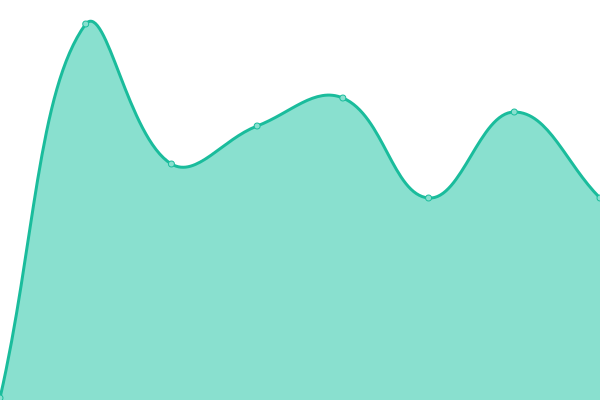
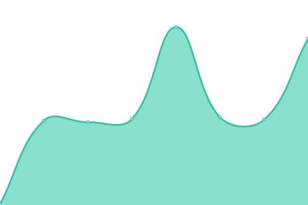
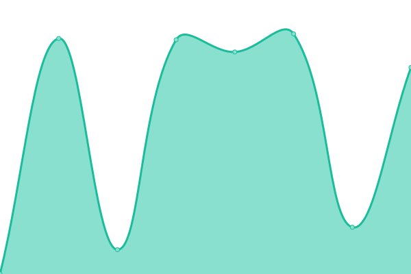
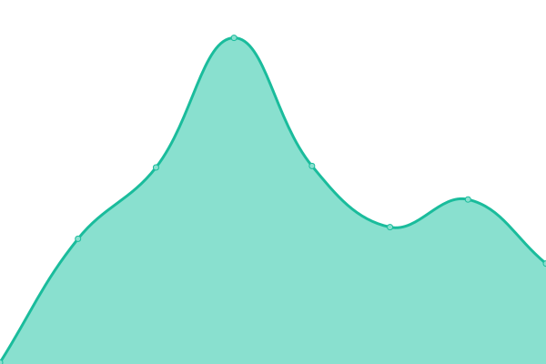
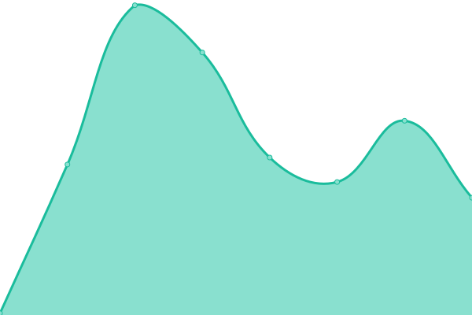
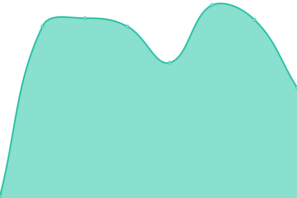
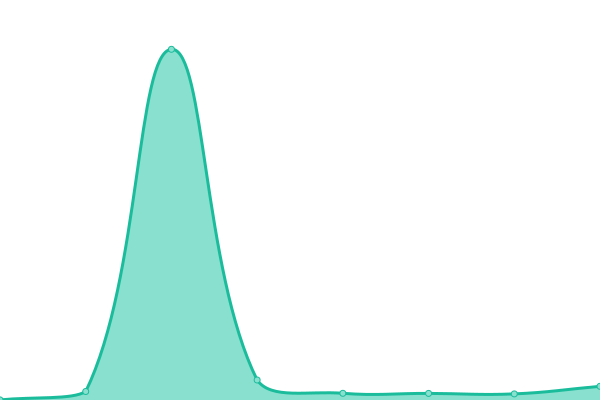

# [📈 Live Status](https://monzim.github.io/upptime): <!--live status--> **🟧 Partial outage**

This repository contains the open-source uptime monitor and status page for [AZRAF AL MONZIM](monzim.com), powered by [Upptime](https://github.com/upptime/upptime).

With [Upptime](https://upptime.js.org), you can get your own unlimited and free uptime monitor and status page, powered entirely by a GitHub repository. We use [Issues](https://github.com/monzim/upptime/issues) as incident reports, [Actions](https://github.com/monzim/upptime/actions) as uptime monitors, and [Pages](https://monzim.github.io/upptime) for the status page.

<!--start: status pages-->
<!-- This summary is generated by Upptime (https://github.com/upptime/upptime) -->
<!-- Do not edit this manually, your changes will be overwritten -->
<!-- prettier-ignore -->
| URL | Status | History | Response Time | Uptime |
| --- | ------ | ------- | ------------- | ------ |
|  [Portfolio](https://monzim.com) | 🟩 Up | [portfolio.yml](https://github.com/monzim/upptime/commits/HEAD/history/portfolio.yml) | 

 109ms
     
 | 

<a href="https://monzim.github.io/upptime/history/portfolio">100.00%</a>
    

|  [VPD Calculator](https://vpd.monzim.com) | 🟩 Up | [vpd-calculator.yml](https://github.com/monzim/upptime/commits/HEAD/history/vpd-calculator.yml) | 

 112ms
     
 | 

<a href="https://monzim.github.io/upptime/history/vpd-calculator">100.00%</a>
    

|  [OpenChat](https://openchat.monzim.com) | 🟩 Up | [open-chat.yml](https://github.com/monzim/upptime/commits/HEAD/history/open-chat.yml) | 

 1657ms
     
 | 

<a href="https://monzim.github.io/upptime/history/open-chat">100.00%</a>
    

|  [OpenChat API](https://openchat-uriepmo.monzim.com) | 🟩 Up | [open-chat-api.yml](https://github.com/monzim/upptime/commits/HEAD/history/open-chat-api.yml) | 

 92ms
     
 | 

<a href="https://monzim.github.io/upptime/history/open-chat-api">100.00%</a>
    

|  [kepathalo](https://kepathalo.monzim.com) | 🟥 Down | [kepathalo.yml](https://github.com/monzim/upptime/commits/HEAD/history/kepathalo.yml) | 

 95ms
     
 | 

<a href="https://monzim.github.io/upptime/history/kepathalo">0.00%</a>
    

|  [niu-analytics](https://niu-analytics.monzim.com) | 🟩 Up | [niu-analytics.yml](https://github.com/monzim/upptime/commits/HEAD/history/niu-analytics.yml) | 

 84ms
     
 | 

<a href="https://monzim.github.io/upptime/history/niu-analytics">100.00%</a>
    

|  [SongKhep](https://songkhep.monzim.com) | 🟩 Up | [song-khep.yml](https://github.com/monzim/upptime/commits/HEAD/history/song-khep.yml) | 

 84ms
     
 | 

<a href="https://monzim.github.io/upptime/history/song-khep">100.00%</a>
    

|  [Aurora Docs](https://docs.aurora.monzim.com) | 🟩 Up | [aurora-docs.yml](https://github.com/monzim/upptime/commits/HEAD/history/aurora-docs.yml) | 

 108ms
     
 | 

<a href="https://monzim.github.io/upptime/history/aurora-docs">100.00%</a>
    

|  UCAM Protector Chrome Extension | 🟩 Up | [ucam-protector-chrome-extension.yml](https://github.com/monzim/upptime/commits/HEAD/history/ucam-protector-chrome-extension.yml) | 

 507ms
     
 | 

<a href="https://monzim.github.io/upptime/history/ucam-protector-chrome-extension">100.00%</a>
    

<!--end: status pages-->

[**Visit our status website →**](https://monzim.github.io/upptime)

## 📄 License

- Powered by: [Upptime](https://github.com/upptime/upptime)
- Code: [MIT](./LICENSE) © [Anand Chowdhary](https://anandchowdhary.com), supported by [Pabio](https://pabio.com)
- Data in the `./history` directory: [Open Database License](https://opendatacommons.org/licenses/odbl/1-0/)
